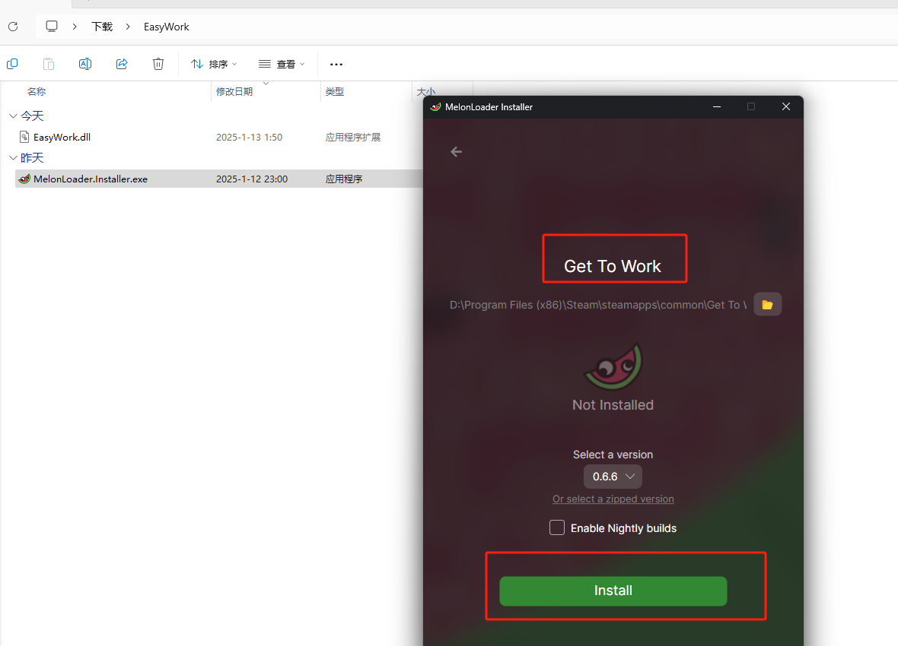
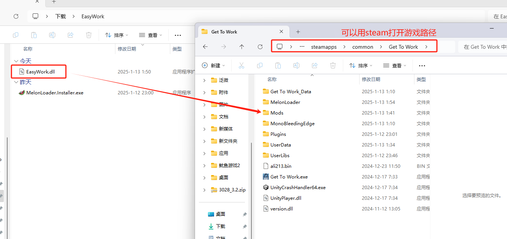
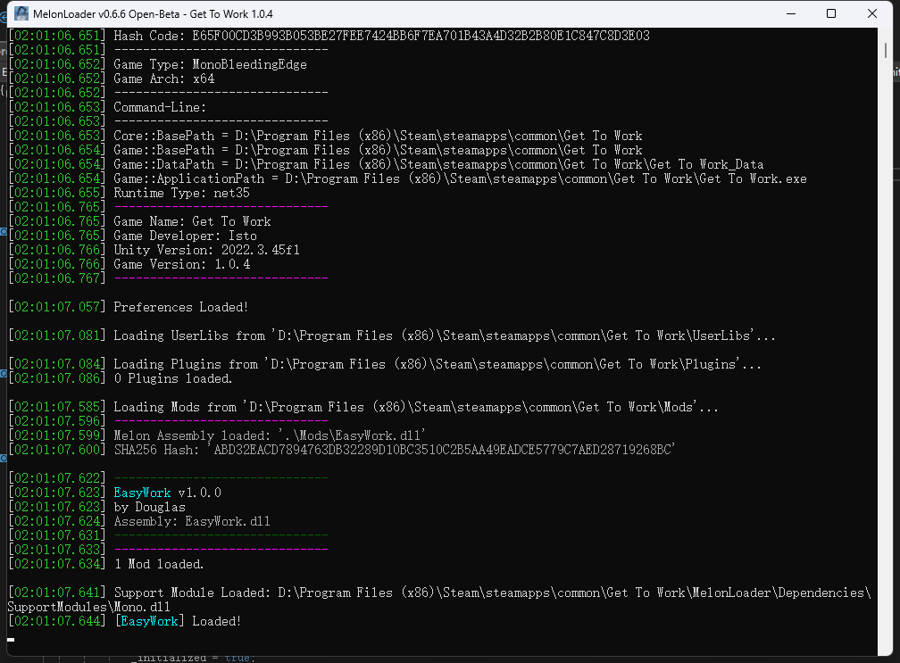

--- 
### EasyWork介绍
这是一个简单的手动存档Mod 用于《Get To Work》游戏

--- 
### 使用方法
1、首先使用MelonLoader.Installer.exe 自动安装注入器

 

2、将EasyWork.dll 复制到游戏路径的Mods文件夹内
（如果你没有使用手柄请复制EasyWork(无手柄版本，删掉括号文字).dll，然后重命名）

 

3、启动游戏弹出窗口 出现 [EasyWork] Loaded! 字样则说明mod注入成功

 

4、使用主键盘上的**数字1键或者手柄的Y按钮**来保存当前位置；使用主键盘上的**数字2键或者手柄的A按钮**来传送回保存的位置。

--- 
### 最后

祝玩得开心，工作easy！
  
---
## Star History

